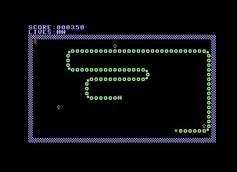

# About

CharSnake64 it's a clone of a classic [video game genre](https://en.wikipedia.org/wiki/Snake_(video_game_genre)) for Commodore 64.  
With its deliberately simple graphics, I just wanted to have fun programming again for the Commodore 64 in c

# Screenshots



# Build from source

The following tools are needed to compile from the source:

* The [cc65](https://cc65.github.io/) compiler
* The [cc1541](https://bitbucket.org/PTV_Claus/cc1541/src/master/) tools for d64 image creation (optional)
* The [Versatile Commodore Emulator](https://vice-emu.sourceforge.io/) for automatic launch and test game (optional)

so after meet these requirements launch
```
make # to build	output snake.prg
make d64 # to build output .d64 image
make test # to build and launch vice for tests
```
